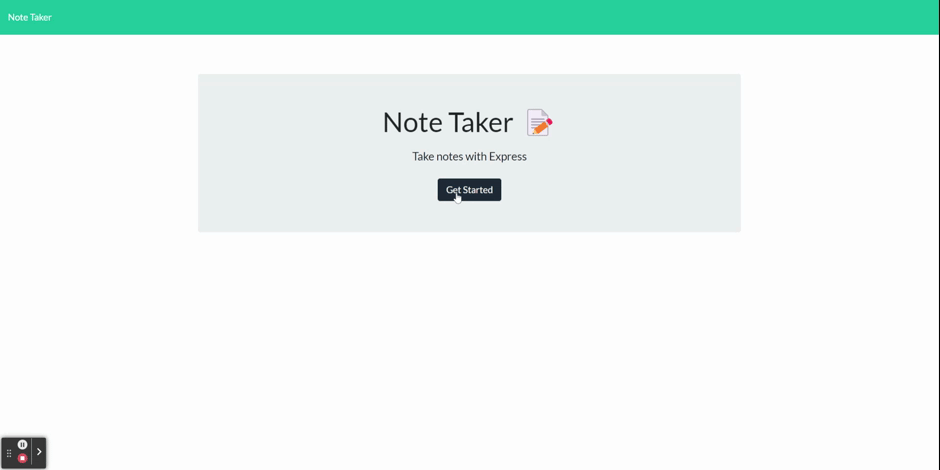

# Note Taker

 

  ## Description

  Welcome to Note Taker! This application is for taking and storing notes, the deployed page is found [here](https://dry-inlet-00419.herokuapp.com/ "Deployed page"). 

  ---

  ## Table of Contents
  
  - [Installation](#installation)
  - [Usage](#usage)
  - [GIF](#gif)
  - [Technologies](#technologies)
  - [License](#license)
  - [Contributions](#how-to-contribute)
  - [Questions](#questions)

  ## Installation

  Clone the repository and then install the correct dependencies through npm.

  ---

  ## Usage

  Use this application by opening up the website found [here](https://dry-inlet-00419.herokuapp.com/ "Deployed page"). Then simply add a note by pressing the "+" add button. Once text is entered in then user has the option to save data by pressing the save icon. User can also delete the note by pressing on the red trash icon.

  ---
      
  ## GIF

  

  ---

  ## Technologies

  This application was created using Node.js with the Express package, multiple built-in packages were used, File system, util, path and this page was deployed on Heroku! 

  ---

  ## License

  [MIT](https://choosealicense.com/licenses/mit/)

  
  ---
  
  ## How to Contribute

  However they would like, email me!

  [Contributor Covenant](https://www.contributor-covenant.org/)

  ---

  ## Questions
  
  Contact me here:   arr5533@gmail.com
  
  [My gitHub profile](https://github.com/Amber-Robeck)

  ---

